# ASC App Beta instructions

These instructions walk beta testers through setting up a **SlumberTek** using the **ASC Connect Stage** app, calibrating it, and then adding it to **Home Assistant**.

> **iOS note:** The flow in TestFlight should be very similar, but the screenshots in this guide are from **Android**.

---

## Before you start

- **SlumberTek installed + powered:** Place your SlumberTek under your mattress and plug it in.
- **2.4 GHz Wi-Fi only:** SlumberTek uses ESP32-C3/C6 hardware and does **not** support 5 GHz networks.
- **Permissions:** When prompted, **allow all permissions** (especially Notifications, Location, and Nearby Devices).
- **Home Assistant users:** During setup, connect SlumberTek to the **same Wi-Fi network** your Home Assistant uses.

---

## Important warning about firmware updates

**Do NOT update SlumberTek firmware unless we explicitly info you to.**

- **Do not** install firmware from docs.asc.com pages.
- **Do not** press any firmware update buttons in the ASC app.

If you update firmware by accident, email us and we’ll send the correct original firmware file for your device.

---

## 1) Install the ASC Connect Stage app

### Android (Google Play beta link)
You will receive a **direct Google Play testing link** from ASC. Use that link to install the app.

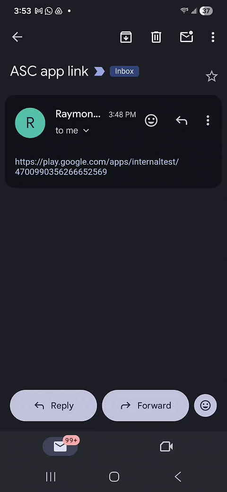

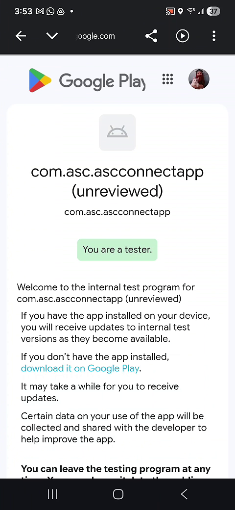

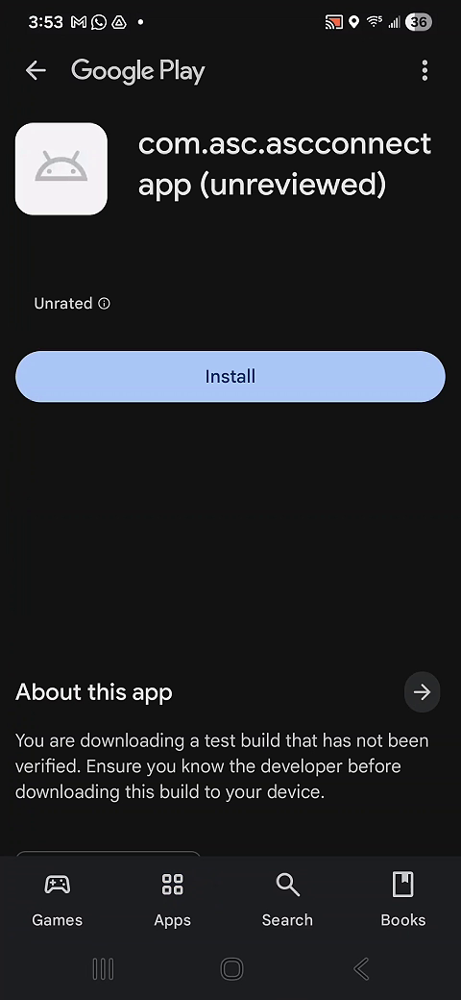

### iOS (TestFlight link)
You will receive a **direct TestFlight link** from ASC. Use that link to install the app.

---

## 2) Create your account and sign in

1. Open **ASC Connect Stage**
2. Create an account:
   - Email + password
   - First/last name
   - Address (required)
3. Confirm your email using the **OTP** code sent to your inbox
4. Sign in

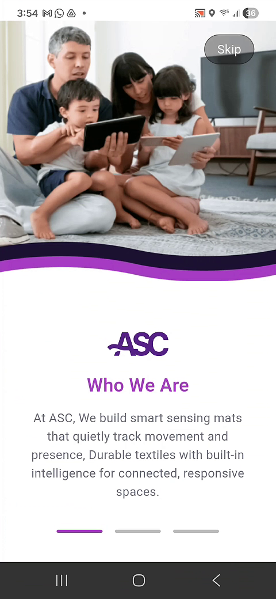

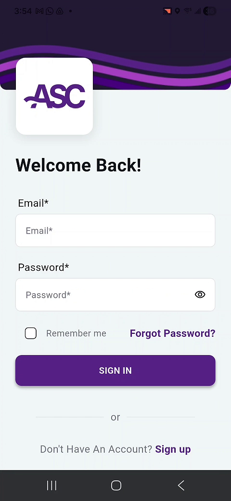

---

## 3) Accept permissions

When prompted, accept all permissions. The most important ones are:

- **Notifications:** Allow
- **Location:** Choose **Precise** + **While using the app**
- **Nearby Devices:** Allow

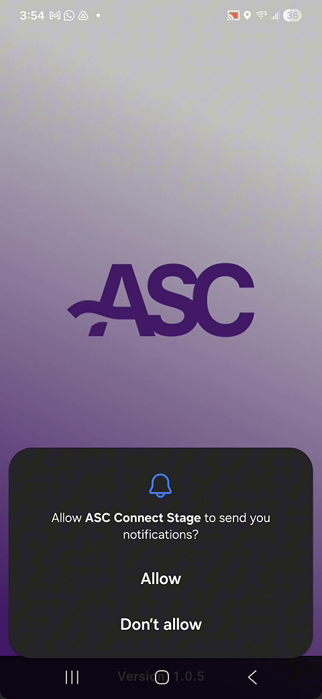

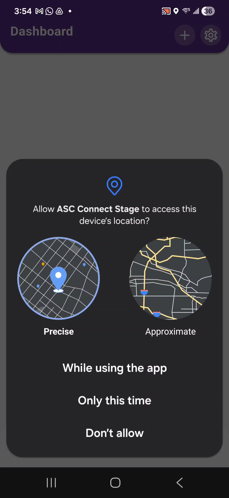

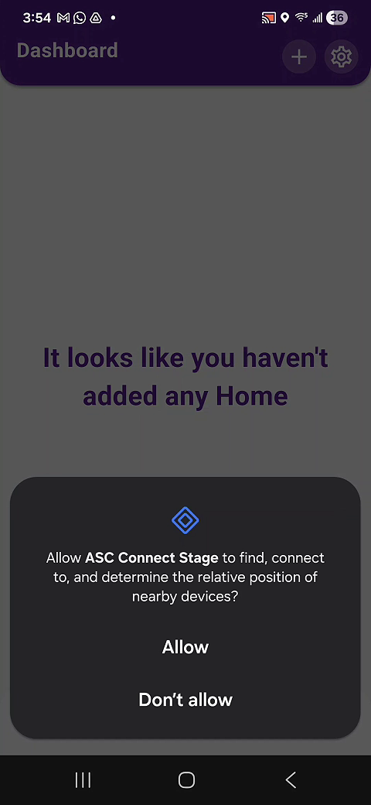

---

## 4) Add your SlumberTek to the app

1. From the main dashboard, tap the **+** (top right)
2. You should see your device listed as:

   **`ST_XXXXXXXXXXXX`** (this is the device MAC address)

3. Tap **Connect** on your `ST_...` device

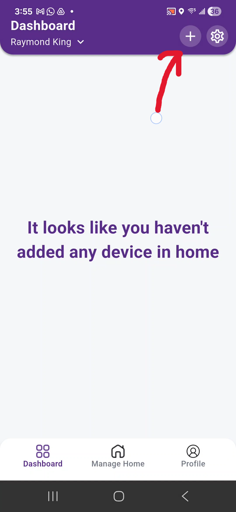

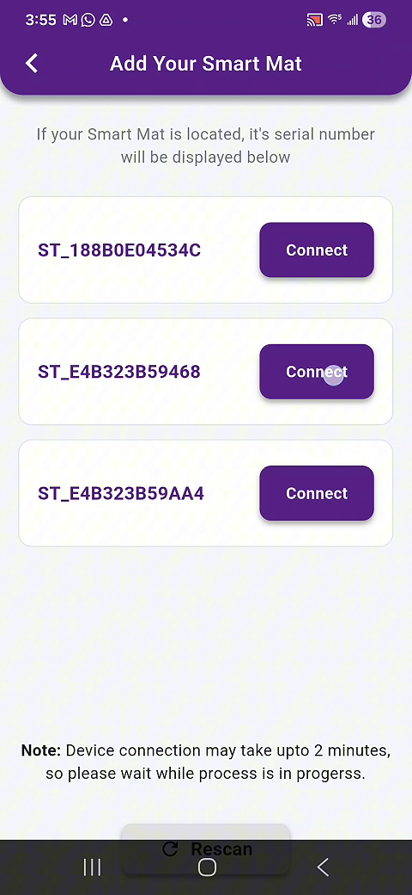

---

## 5) Connect SlumberTek to Wi-Fi (same network as Home Assistant)

1. Select your **2.4 GHz** Wi-Fi network
2. Enter the Wi-Fi password
3. Tap **Verify** (or the confirm button shown in the app)

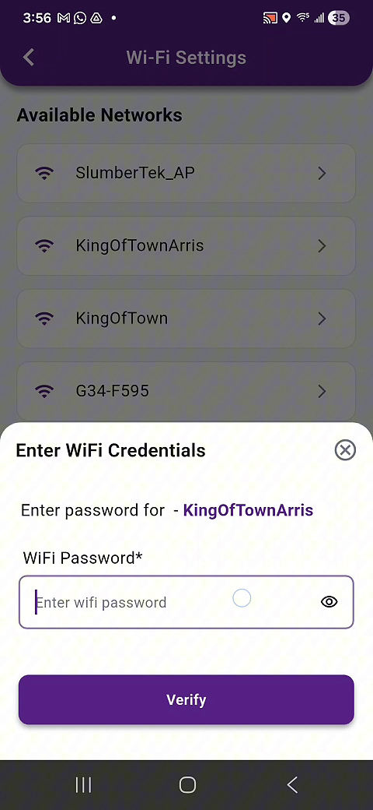

### If Wi-Fi setup fails the first time (common beta bug)
Sometimes the first provisioning attempt fails with an error like:

**“Wrong credentials or network error”**

If that happens:
- Try again (same network + same password)
- Most users find the **second attempt works**

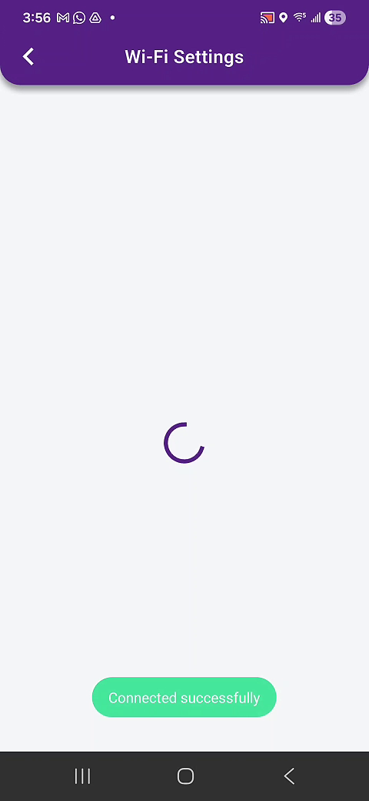

---

## 6) Assign the device to a Room (required)

SlumberTek must live inside a **Room** in the app.

- If you don’t have a Room yet, you will need to create one.
- Create the Room, then continue.

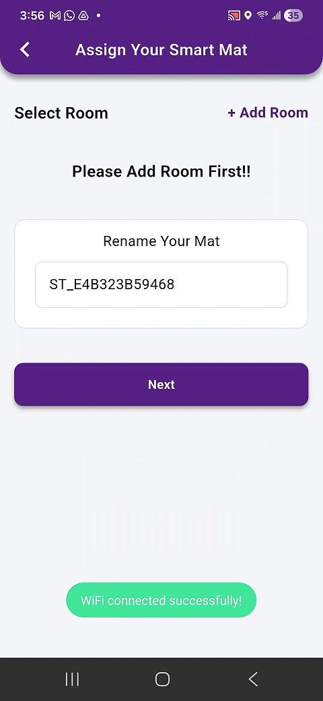

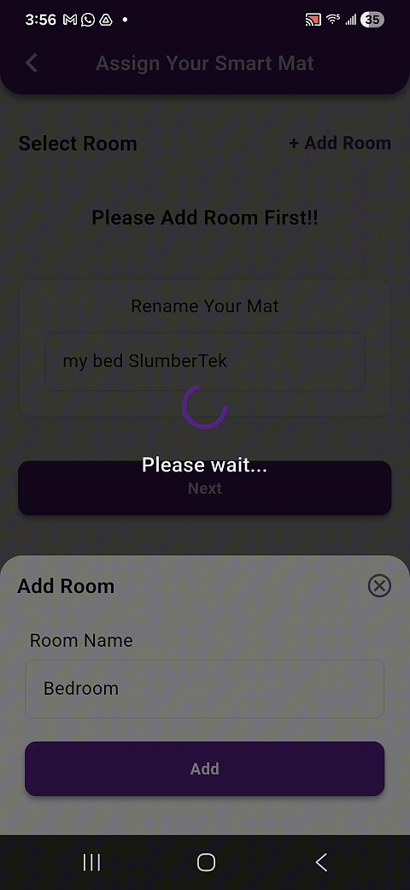

Then name your device and finish the setup flow.

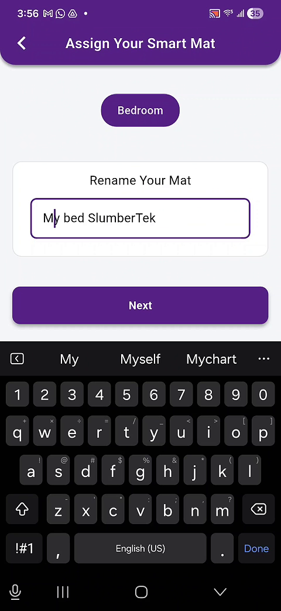

---

## 7) Run calibration

Calibration establishes an initial baseline reading (auto calibration continues to adjust day-to-day).

1. Click on your device from the dashboard to open it
2. Scroll down to **Calibration** and tap into it (**Known bug** **it can take up to a minute or so for your SlumberTek to connect to the App**)
3. Tap **Start Calibration**
4. Wait a few seconds for calibration to begin
5. **Get into bed normally** and stay there until the calibration finishes (about **45 seconds**)

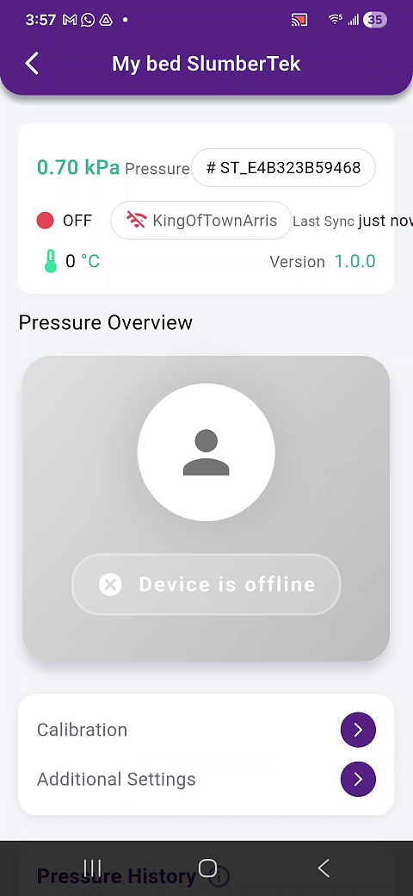

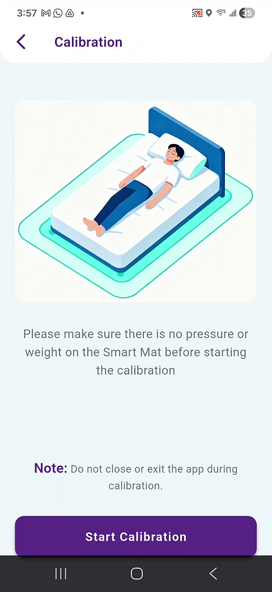

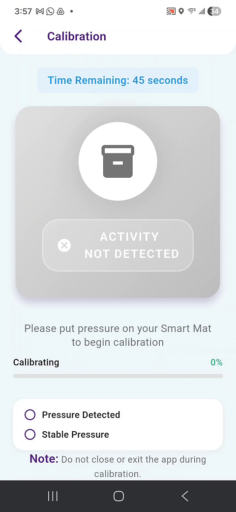

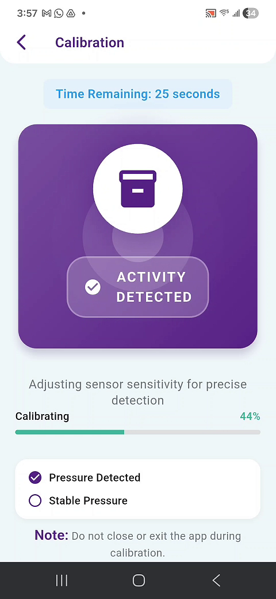

After calibration, you should see a success/complete state.

---

## 8) Quick test (make sure it’s working)

After calibration:
1. Get in and out of bed a few times
2. Confirm:
   - The in-app status/indicator updates
   - You start receiving **occupied / unoccupied** notifications

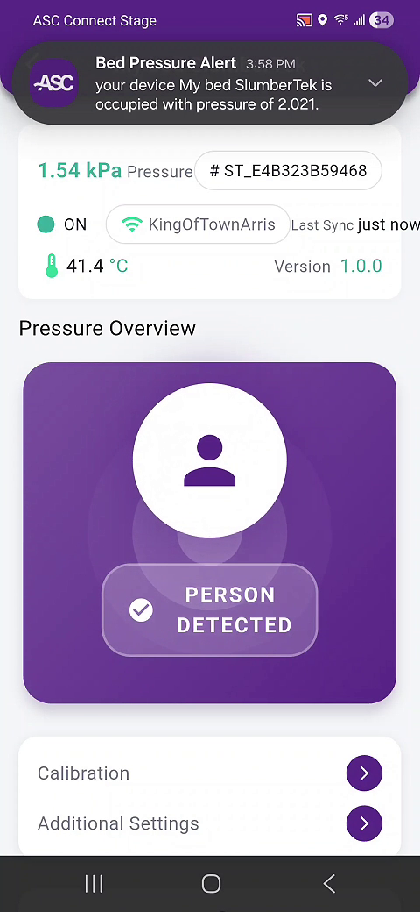

---

## 9) DO NOT press “Check Firmware Update”

On the device page, you may see a **Check Firmware Update** option below Calibration.

**Do not press it** unless Raymond emails you and tells you to.

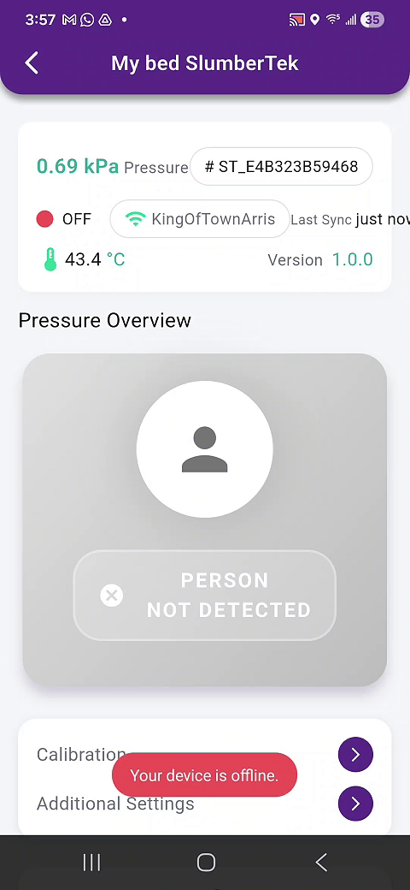
<!-- Replace the image above with a screenshot that clearly shows the "Check Firmware Update" button once you have it in images/. -->

---

## 10) Add SlumberTek to Home Assistant (ESPHome)

Once SlumberTek is on your network, it should show up automatically in Home Assistant.

1. In Home Assistant go to:
   **Settings → Devices & Services**
2. Look for it under **Discovered**
3. The discovered name should look like:

   **Bed Calibration XXXXXXXXXXXX** (the X’s are the MAC address)

4. Add it like any other discovered ESPHome device

If it doesn’t appear, email us and include:
- Your SlumberTek `ST_...` name / MAC
- Your Home Assistant version (if you know it)
- Anything you noticed during Wi-Fi setup

---

## Known beta limitations

Right now:
- You cannot fully control (or disable) occupied/unoccupied notifications in the app
- There is no notification history after you swipe a notification away

This is beta, so feedback is expected and appreciated.

---

## What feedback we want from beta testers

Please email feedback to any existing ASC thread you’re on, or to **beta@asc.com**.

Helpful feedback includes:
- Your overall experience using the app
- Features you’d want next
- Any times Home Assistant and the app disagree on bed presence
- Any connectivity issues between SlumberTek and the app
- A quick description of what happened, and whether it’s repeatable

---

## Next steps

- If anything feels confusing or buggy, email **beta@asc.com** and we’ll help you troubleshoot.
