

# Loading ESPHome onto your TrampleTek Blue or SlumberTek using [ESP Web tools](https://esphome.github.io/esp-web-tools/)

## These instructions are for default Home Assistant UI with the ESPHome add-on
If you are a Home Assistant power-user I suggest jumping to [Manual Installation](https://appliedsensorco.github.io/Manual-Installation/mat_install.html) section and altering the directions and files as you need. If you are not a Home Assistant power-user yet, then these instructions are for you.

## (Warning) Easy Mode installation is dependent on web-based tools that might change. If this mode works, great(!), you can skip the Manual Install section. If this doesn't work jump to the [Manual Installation](https://appliedsensorco.github.io/Manual-Installation/) section.

## You can watch the videos here or follow the step-by-step instructions below
<iframe width="100%" height="315" src="https://www.youtube.com/embed/4sYf2Vkg71Q?si=UqCthmTVpdZ0zf8B" title="YouTube video player" frameborder="0" allow="accelerometer; autoplay; clipboard-write; encrypted-media; gyroscope; picture-in-picture; web-share" referrerpolicy="strict-origin-when-cross-origin" allowfullscreen></iframe>
## SlumberTek & TrampleTek Easy Mode Install – Full Tutorial & Fixes

<iframe width="100%" height="315" src="https://youtube.com/embed/dUKVttC4c4Q?si=fHLXH6EFcx_rD7p6" title="YouTube video player" frameborder="0" allow="accelerometer; autoplay; clipboard-write; encrypted-media; gyroscope; picture-in-picture; web-share" referrerpolicy="strict-origin-when-cross-origin" allowfullscreen></iframe>
## Install SlumberTek on a box spring bed

<iframe width="100%" height="315" src="https://youtube.com/embed/us4oqqxydCk?si=gRAxwMvxtb9tkbsr" title="YouTube video player" frameborder="0" allow="accelerometer; autoplay; clipboard-write; encrypted-media; gyroscope; picture-in-picture; web-share" referrerpolicy="strict-origin-when-cross-origin" allowfullscreen></iframe>
## Install SlumberTek on a bed with slats

- ESP Web tools only work with *Google Chrome* or *Microsoft Edge*. Open another window of your browser, as it can be hard to read the instructions and use the ESP Web tool (it covers the webpage).

- Click on either the "TrampleTek Blue Firmware install" or "SlumberTek Firmware install" button below to start the ESP Web tool:

📡 Heads up! By installing the firmware, you agree to allow your device to **send anonymous data to ASC** to help improve future firmware. If you'd rather not help improve future firmware, you can turn it off in [settings](https://docs.asc.com/SlumberTek.html) after installation. (Note: TrampleTek Blue does not currently send data).
  
<esp-web-install-button manifest="https://raw.githubusercontent.com/AppliedSensorCo/ASC-product-code/main/TrampleTekBlue/TrampleTekBlue.json" install-supported="">
        <button slot="activate">TrampleTek Blue Firmware install button</button>
        <i slot="unsupported">
          <b><u> You have no buttons! This is an error message! </u></b> The buttons are not here because your browser does not support Web
          Serial or your browser is blocking them! Try this page again in Google Chrome or Microsoft Edge instead
            (but not on your iOS device).
        </i>
</esp-web-install-button>

<esp-web-install-button manifest="https://raw.githubusercontent.com/AppliedSensorCo/ASC-product-code/main/SlumberTek/SlumberTek.json" install-supported="">
        <button slot="activate">SlumberTek Firmware install button</button>
        <i slot="unsupported">
            The buttons are nice, I hope you can get them to work.
        </i>
</esp-web-install-button>

<esp-web-install-button manifest="https://raw.githubusercontent.com/AppliedSensorCo/ASC-product-code/main/SlumberTek/Rollback-versions/0-2-3/SlumberTek-ver023.json" install-supported="">
        <button slot="activate">SlumberTek Firmware rollback backup to previous version (0.2.3)</button>
        <i slot="unsupported">
            This would be the SlumberTek rollback button.
        </i>
</esp-web-install-button>

### If you don't see two purple buttons above this line, you may need to switch to a different browser or check your browser settings.

- The below pop-up will appear asking to select the COM port for your device. You can plug and un-plug your devices's USB cable into the computer you're using to see which COM port appears and disappears, pick that option and press "connect." (If you don't see anything showing up when you plug your USB cable into the computer you may have a USB driver issue, if you hit cancel a pop-up will give you some info on how to install the right USB drivers).

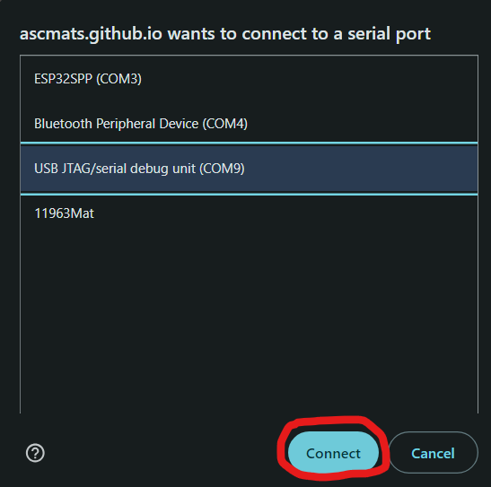 

My COM port was COM9 in this example.

- If the ESP Web tools successfully connect to the device you will see this pop-up, click either "Install TrampleTek Blue Firmware" or "Install SlumberTek Firmware".

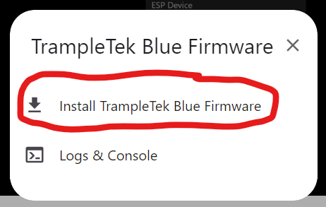 

- You will get another pop-up to confirm, click "Install" (firmware version will be different from this image).

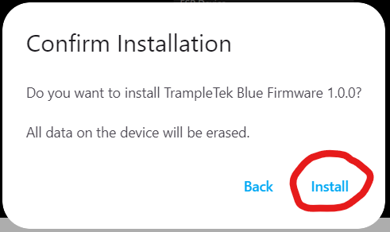 

- At first it will say "Erasing" for a bit, and then it will start to install.

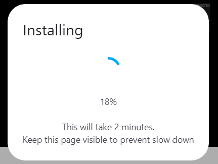

### WARNING! I'VE BEEN GETTING REPORTS OF BROWSER CRASHES AFTER THE INSTALL STEP COMPLETES (4/10/25). If that happens, open this page back up and press the "Connect" button at the top of this page again, select your COM port, then click on "Connect to Wi-Fi" to continue through the instructions. The firmware is installed, something is just going wrong with the ESP web tool and it's crashing the browser.

- After a few minutes it should be successful!

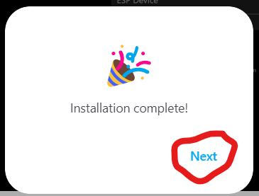 

- Next it should ask for your Wi-Fi credentials, if you make a mistake it'll let you know.

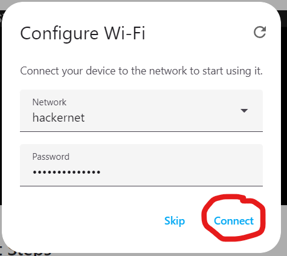

- Once your Wi-Fi has been accepted there are several ways to integrate the device into Home Assistant, this is easiest. Click on "Add to Home Assistant".

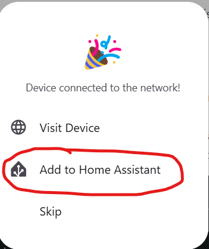

- That will open a new tab that wants to connect to the default web address for Home Assistant. Click on the "Open Link".

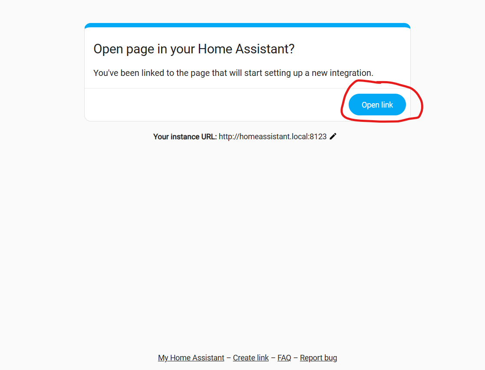

- This will jump you directly to your Settings --> Devices & Services page in Home Assistant. Click "Ok" to setup the device in ESPHome.

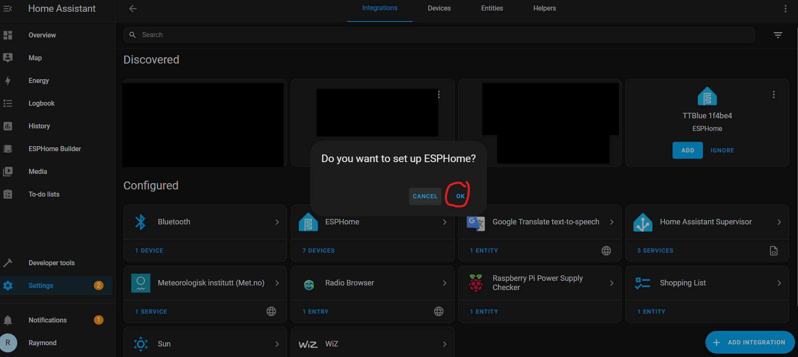

- Select the new TTBlue or SlumberTek device.

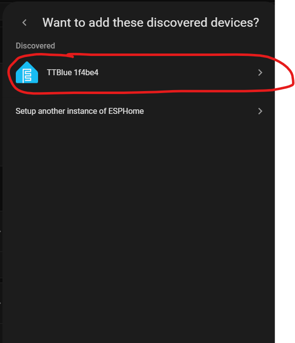

- Then you have to click submit.

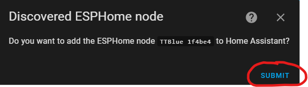

- Next pick where in Home Assistant you want to assign the device, click "Finish", and you're done installing your device!

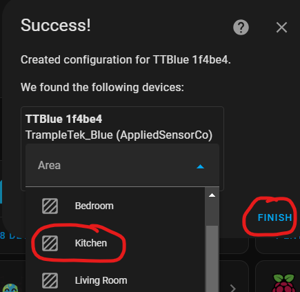

- Your device will have a name of "TTBlue xxxxxx" or "SlumberTek xxxxxx", if you want to change it I suggest manually going to each UI element in the Home Assistant dashboard and clicking on the gear icon to rename. Alternatively you can "Take Control" of the device and it will automatically rename all the UI elements, but it's a little more complex. Instructions for that are here: [(Optional) Taking Control of your device in ESPHome](https://appliedsensorco.github.io/esphometakecontrol.html).

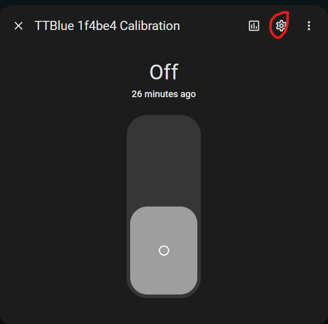

## Next Steps
If this worked, then you can **SKIP** the Manual Installation section and move directly to understanding the [UI elements of TrampleTek Blue](https://appliedsensorco.github.io/usingHAui.html) or the [UI elements of SlumberTek](https://docs.asc.com/SlumberTek.html)

If you want to take full control of your TrampleTek Blue or SlumberTek then check out these optional instructions [(Optional) Taking Control of your device in ESPHome](https://appliedsensorco.github.io/esphometakecontrol.html)

Please join the [ASC Discord server](https://discord.gg/cB9P6NmYJg) if you have questions or comments about this page.

