

# Easy Mode Installation

Load the ESPHome firmware onto your TrampleTek Blue or SlumberTek straight from this page using [ESP Web Tools](https://esphome.github.io/esp-web-tools/). Your browser talks to the device over the USB cable, so there is nothing to download or install on your computer.

> **Home Assistant power users:** you may prefer to jump to [Manual Installation](https://docs.asc.com/Manual-Installation/mat_install.html) and alter the directions and files as you need. If you are not a Home Assistant power-user yet, then these instructions are for you.

> **Heads up:** Easy Mode installation depends on web-based tools that might change. If this mode works, great(!), you can skip the Manual Install section entirely. If this doesn't work, jump to the [Manual Installation](https://docs.asc.com/Manual-Installation/) section.

---

## What you'll need

- **Your device and the USB cable that came in the box.** The cable has to carry **data** — charge-only cables are a very common source of grief.
- **A computer running Google Chrome or Microsoft Edge.** ESP Web Tools does not work in Safari or Firefox, and it does not work on a phone or tablet.
- **Your 2.4 GHz Wi-Fi name and password.** These devices do **not** support 5 GHz networks.
- **Home Assistant with the ESPHome add-on installed.** See [Requirements](https://docs.asc.com/requirements.html) if you don't have that running yet.

> **Tip:** Open this page in a second browser window. The ESP Web Tools pop-up covers the webpage, and it can be hard to read the instructions and use the tool at the same time.

> 📡 **Heads up!** By installing the firmware, you agree to allow your device to **send data to ASC** to help improve future firmware. If you'd rather not help improve future firmware, you can turn it off in [settings](https://docs.asc.com/SlumberTek.html) after installation. (Note: TrampleTek Blue does not currently send data.)

---

## Prefer to watch? Full tutorial video

SlumberTek & TrampleTek Easy Mode Install – Full Tutorial & Fixes

<iframe width="100%" height="315" src="https://www.youtube.com/embed/4sYf2Vkg71Q?si=UqCthmTVpdZ0zf8B" title="YouTube video player" frameborder="0" allow="accelerometer; autoplay; clipboard-write; encrypted-media; gyroscope; picture-in-picture; web-share" referrerpolicy="strict-origin-when-cross-origin" allowfullscreen></iframe>

---

## 1) Plug your device into your computer

**This is the first step and it's easy to miss.** Plug the USB cable that came with your TrampleTek Blue or SlumberTek into the device, and plug the other end **directly into a USB port on your computer** — not a wall charger, not a phone brick.

- The device needs to **stay plugged in for the whole install**.
- Plug straight into the computer if you can, and skip USB hubs and docks.
- **Use the cable from the box.** Many spare cables only carry power, and a charge-only cable means your device will never show up in the COM port list in step 3.

<!-- Add a photo here of the device plugged into a laptop once you have one in images/. -->

---

## 2) Click the install button for your device

Click either the **"TrampleTek Blue Firmware install"** or the **"SlumberTek Firmware install"** button below to start the ESP Web tool.

<esp-web-install-button manifest="https://raw.githubusercontent.com/AppliedSensorCo/ASC-product-code/main/TrampleTekBlue/TrampleTekBlue.json" install-supported="">
        <button slot="activate">TrampleTek Blue Firmware install button</button>
        <i slot="unsupported">
          <b><u> You have no buttons! This is an error message! </u></b> The buttons are not here because your browser does not support Web
          Serial or your browser is blocking them! Try this page again in Google Chrome or Microsoft Edge instead
            (but not on your iOS device).
        </i>
</esp-web-install-button>

<esp-web-install-button manifest="https://raw.githubusercontent.com/AppliedSensorCo/ASC-product-code/main/SlumberTek/SlumberTek.json" install-supported="">
        <button slot="activate">SlumberTek Firmware install button</button>
        <i slot="unsupported">
            The buttons are nice, I hope you can get them to work.
        </i>
</esp-web-install-button>

<!-- <esp-web-install-button manifest="https://raw.githubusercontent.com/AppliedSensorCo/ASC-product-code/main/SlumberTek/Rollback-versions/0-2-3/SlumberTek-ver023.json" install-supported="">
        <button slot="activate">SlumberTek Firmware rollback backup to previous version (0.2.3)</button>
        <i slot="unsupported">
            This would be the SlumberTek rollback button.
        </i>
</esp-web-install-button> -->

> **Don't see two purple buttons above this line?** You may need to switch to a different browser or check your browser settings. ESP Web Tools only works in Google Chrome or Microsoft Edge.

---

## 3) Pick your device's COM port

The below pop-up will appear asking to select the COM port for your device. You can plug and un-plug your device's USB cable into the computer you're using to see which COM port appears and disappears, pick that option and press **"Connect."**

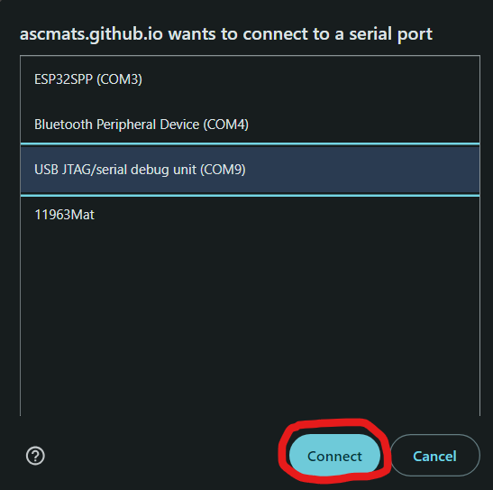

My COM port was COM9 in this example.

> **Nothing shows up in the list?** You may have a USB driver issue, or a charge-only cable. If you hit cancel, a pop-up will give you some info on how to install the right USB drivers.

---

## 4) Install the firmware

- If the ESP Web tools successfully connect to the device you will see this pop-up. Click either **"Install TrampleTek Blue Firmware"** or **"Install SlumberTek Firmware"**.

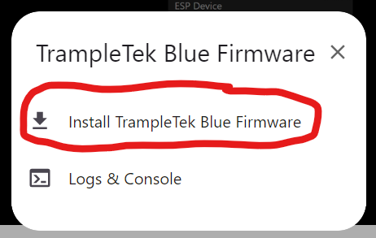

- You will get another pop-up to confirm, click **"Install"** (firmware version will be different from this image).

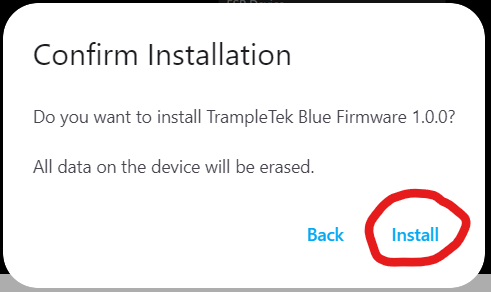

- At first it will say "Erasing" for a bit, and then it will start to install.

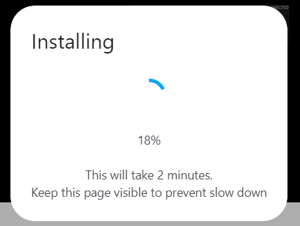

- After a few minutes it should be successful!

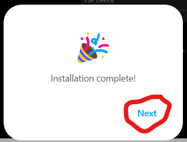

> ⚠️ **Browser crashes after the install step completes (reported 4/10/25).** If that happens, open this page back up and press the "Connect" button at the top of this page again, select your COM port, then click on "Connect to Wi-Fi" to continue through the instructions. The firmware is installed, something is just going wrong with the ESP web tool and it's crashing the browser. Check out [Easy Mode Troubleshooting Tips](https://docs.asc.com/EasyModeTroubleshooting.html) if this crashing is messing up your install.

---

## 5) Enter your Wi-Fi credentials

Next it should ask for your Wi-Fi credentials. Remember it has to be a **2.4 GHz** network, and if you make a mistake it'll let you know.

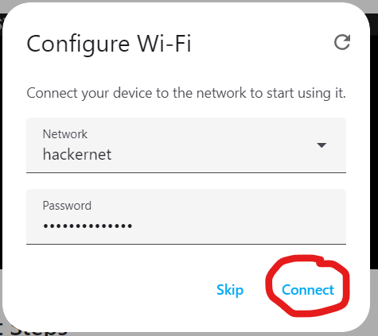

---

## 6) Add the device to Home Assistant

- Once your Wi-Fi has been accepted there are several ways to integrate the device into Home Assistant, this is easiest. Click on **"Add to Home Assistant"**.

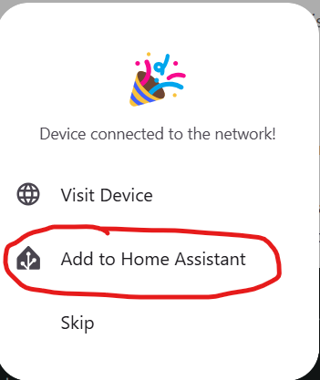

- That will open a new tab that wants to connect to the default web address for Home Assistant. Click on **"Open Link"**.

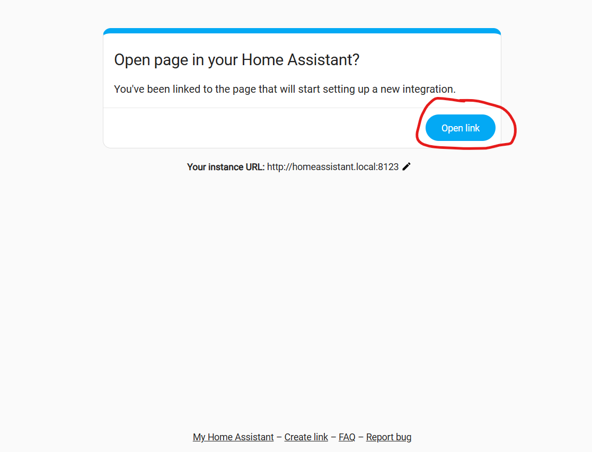

- This will jump you directly to your Settings → Devices & Services page in Home Assistant. Click **"Ok"** to setup the device in ESPHome.

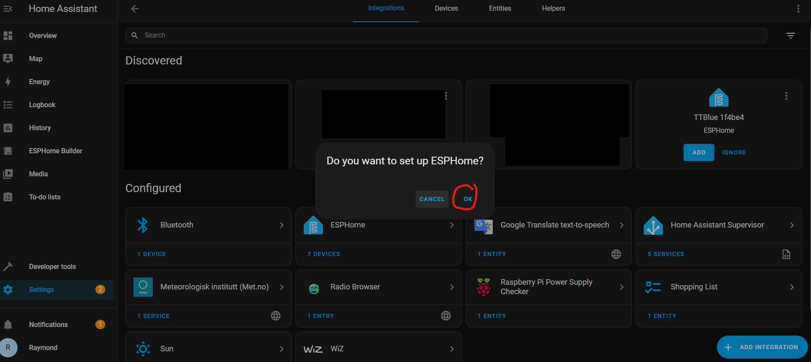

- Select the new TTBlue or SlumberTek device.

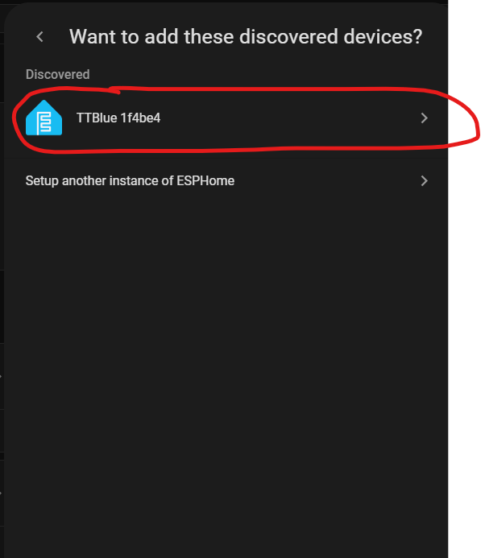

- Then you have to click **submit**.

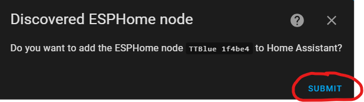

- Next pick where in Home Assistant you want to assign the device, click **"Finish"**, and you're done installing your device!

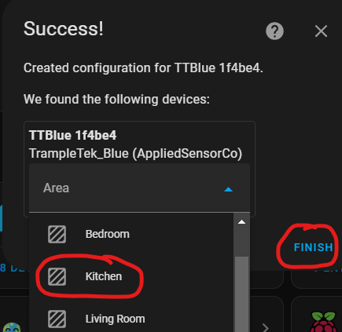

---

## 7) (Optional) Rename your device

Your device will have a name of "TTBlue xxxxxx" or "SlumberTek xxxxxx". If you want to change it I suggest manually going to each UI element in the Home Assistant dashboard and clicking on the gear icon to rename. Alternatively you can "Take Control" of the device and it will automatically rename all the UI elements, but it's a little more complex. Instructions for that are here: [(Optional) Taking Control of your device in ESPHome](https://docs.asc.com/esphometakecontrol.html).

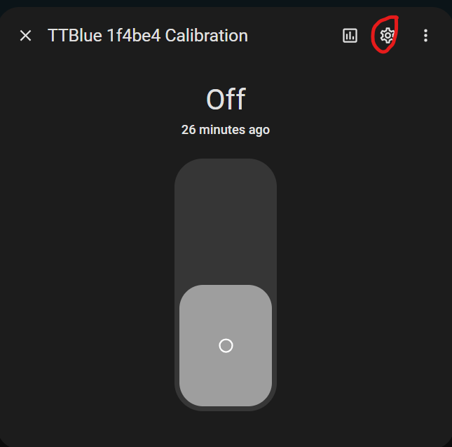

---

## Mounting SlumberTek under your mattress

Once the firmware is installed, here's where the device physically goes.

### Install SlumberTek on a box spring bed
<iframe width="100%" height="315" src="https://youtube.com/embed/dUKVttC4c4Q?si=fHLXH6EFcx_rD7p6" title="YouTube video player" frameborder="0" allow="accelerometer; autoplay; clipboard-write; encrypted-media; gyroscope; picture-in-picture; web-share" referrerpolicy="strict-origin-when-cross-origin" allowfullscreen></iframe>

### Install SlumberTek on a bed with slats
<iframe width="100%" height="315" src="https://youtube.com/embed/us4oqqxydCk?si=gRAxwMvxtb9tkbsr" title="YouTube video player" frameborder="0" allow="accelerometer; autoplay; clipboard-write; encrypted-media; gyroscope; picture-in-picture; web-share" referrerpolicy="strict-origin-when-cross-origin" allowfullscreen></iframe>

---

## If something goes wrong

- **Most install problems:** [Easy Mode Troubleshooting Tips](https://docs.asc.com/EasyModeTroubleshooting.html)
- **Device won't connect or keeps restarting:** [Boot Mode Instructions](https://docs.asc.com/bootmode.html)
- **Device is offline or lost its Wi-Fi:** [Reconnect after Factory Reset](https://docs.asc.com/SlumberTekReconnect.html)
- **Easy Mode just won't work:** [Manual Installation](https://docs.asc.com/Manual-Installation/)

## Next Steps
If this worked, then you can **SKIP** the Manual Installation section and move directly to understanding the [UI elements of TrampleTek Blue](https://docs.asc.com/usingHAui.html) or the [UI elements of SlumberTek](https://docs.asc.com/SlumberTek.html)

If you want to take full control of your TrampleTek Blue or SlumberTek then check out these optional instructions [(Optional) Taking Control of your device in ESPHome](https://docs.asc.com/esphometakecontrol.html)

Please join the [ASC Discord server](https://discord.gg/cB9P6NmYJg) if you have questions or comments about this page.

