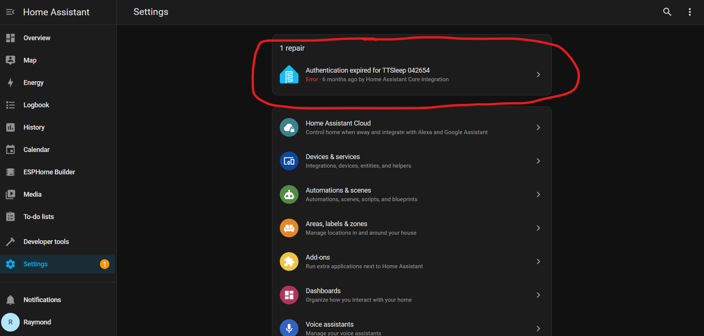
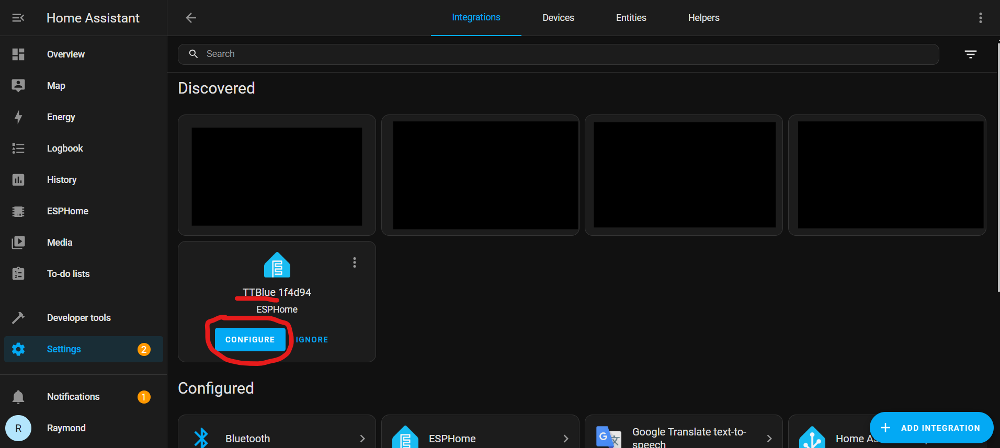
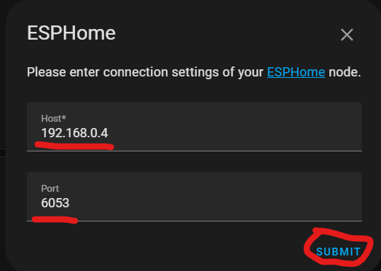
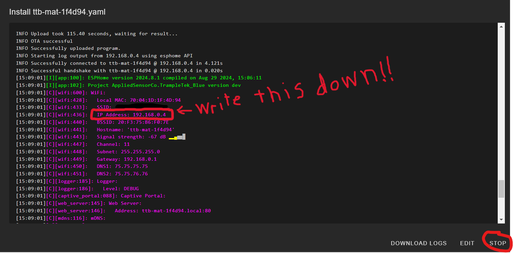

# Easy Mode installation troubleshooting tips

## Sometimes things don't always go so smoothly, or you have a unique Home Assistant setup that adds a few unexpected hurdles! Hopefully one of these tips will help you.

### 1)  Home Assistant API encryption issues ([video link](https://youtu.be/4sYf2Vkg71Q?si=KegT5pdxMYknnxuy&t=280))

I haven't found a consistent reason that this issue comes up 🫤. The error often shows up soon after an install and may look something like this:

The only solution I know is unfortunately to re-install the firmware to your device. That will recreate the encryption authentication.

### 2) ESPHome didn't automatically share your device IP with Home Assistant ([video link](https://youtu.be/4sYf2Vkg71Q?si=OFX0iIcHcgAUsIJX&t=314))

When you go to add your new ESPHome device into HA:

Instead of getting a pop up UI to easily add your device into Home Assistant you get this pop-up:

The PORT should be 6053 (that's ESPHome's default port), but your IP address is unique to your device. There are several ways to find the IP address of your device. I suggest plugging your device into your computer, connecting it to [ESP Web tools](https://web.esphome.io/) and then opening up the LOGS.

That will get you to a lot of output (you may need to press the "Restart" button within the log page) and you can scroll through the output to find your device's IP:

This [video link](https://youtu.be/4sYf2Vkg71Q?si=OFX0iIcHcgAUsIJX&t=314) explains how to do this with more detail.

### 3) Device seems to be constantly restarting ([video link](https://youtu.be/4sYf2Vkg71Q?si=KKhr6HFME9f2fJyz&t=391))

This is hard to tell if you are just powering the device with the USB cable to a plug, but if you connect your device into a computer you can hear the USB connection disconnect and reconnect sound over and over again. This means the firmware has been corrupted and you need to put the device into Boot Mode to get it out of the "boot-up -> fail -> restart -> boot-up" cycle. 

You will need to follow the [Boot Mode Instructions](https://docs.asc.com/bootmode.html) link and then you can re-install the firmware using the Easy Mode Install method.

### 4) There are always more bugs to fix and documentation to improve! If you have a problem not covered here email raymond@asc.com and I'll help you fix it, and maybe make a new section here about it 😁.

## Next Steps
**SKIP** the Manual Installation section and move directly to understanding the [UI elements of TrampleTek Blue](https://appliedsensorco.github.io/usingHAui.html) or the [UI elements of SlumberTek](https://docs.asc.com/SlumberTek.html)

Please join the [ASC Discord server](https://discord.gg/cB9P6NmYJg) if you have questions or comments about this page.
