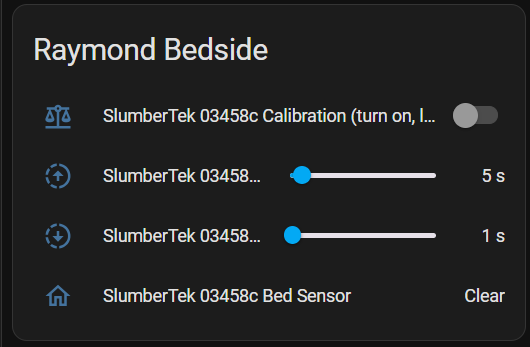
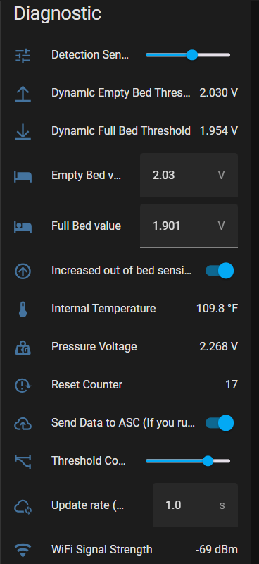

# Explanation of the User Interface (UI) entities of the SlumberTek

## User Interface Overview

(The full names of the entities are not Viewable because SlumberTek XXXXXX is such a long name, hover your mouse over your HA entities to see their full names.) 

### The UI has four UI entities **"Calibration"**, **"Transition to Off Delay"**, **"Transition to On Delay"**, and **"Bed Sensor"**.

### Calibration (turn on, lay on bed for at least 30s, get out of bed, turn off)
This helps set the thresholds for your bed the first time you use the sensor, or as a reset if you make a significant change to your bed set up. To calibration make sure you device is placed under you mattress at chest level, toggle the calibration switch on, lay on the bed for at least 30s, get out of the bed, toggle the switch off and you're done!

### Transition to Off Delay
This is the delay before the sensor sends an "off" signal to Home Assistant. I suggest this value be at least a 2-3 seconds, as big motions during the night have a chance of triggering a false "off" signal.

### Transition to On Delay
This is the delay before the sensor sends an "on" signal to Home Assistant. Typically this value can safely be 1-2 seconds without worrying about false "on" signals.

### Bed Sensor
Binary occupancy sensor that says when someone is in bed (occupied) or not (clear).

## Diagnostic UI entities (only visible if you go into the ESPHome device settings)

# This section is being actively worked on 4/3/25
### There are thirteen Diagnostic entities:

### Detection Sensitivity (lower is more sensitive)
Lower values help to trigger events quicker. When "Increased out of bed sensitivity mode" is *off* this value is only applied to getting into bed events ("on"). When "Increased out of bed sensitivity mode" is on, the default is increased to 6 to h
Increasing this value causes the "matDownThreshold" and "matUpThreshold" to pull in closer to the "Pressure Voltage", which causes the likelihood of triggering on or off of the "Mat Sensor" from the more dynamic "matDownThreshold" and "matUpThreshold" instead of the more static "Empty Bed value" and "Full Bed value".

### Threshold Convergence Factor
The sensor's baseline voltage typically drifts up and down everyday, so the "Empty Bed" and "Full Bed" thresholds are adjusted every 8 hours based on the previous 24 hours data to keep the sensor more accurate across days. After estimating the updated thresholds from the last 24hrs' data the "Convergence factor" shrinks the gap between the new thresholds. A "10" reduction factor sets both the new thresholds to the same value, which I don't think would work well 🤔, but everything is being tested because it's a beta test! The slider exists to experiment with what values work best for people!

### Empty Bed value
For this firmware version, this is the only trigger for turning off the "Mat Sensor" binary sensor. The "Pressure Voltage" must be above the "Empty Bed Value" for the full duration of the "Transition to Off Delay" value before the "Mat Sensor" is turned *off*.

This value is fully adjustable to tweak the thresholds manually if needed, however the automatic threshold will take over after the next 8 hour period.

### Full Bed value
For this firmware version, this is one of the triggers for turning on the "Mat Sensor" binary sensor. If the "Pressure Voltage" is below the "Full Bed Value" for the full duration of the "Transition to On Delay" value before the "Mat Sensor" is turned *on*.

### MatDownThreshold (Beta debug info)
This dynamic threshold moves with the "Pressure Voltage" signal. Increasing the "Sensitivity" makes the "MatDown Threshold" follow closer to the Pressure Voltage. The mats are typically less responsive to getting into bed and it can take a while for the "Pressure Voltage" to settle down to the level of the "Full Bed Threshold" or below. So this threshold helps to quickly trigger that first time you get into bed, which is often a smaller signal than getting out of bed.

### MatUpThreshold (Beta debug info)
This dynamic threshold moves with the "Pressure Voltage" signal. This dynamic threshold is similar to the "MatDownThreshold" except it helps to trigger off signals to "Mat Sensor" faster. However, this was causing a decent amount of false negative (I'm still in bed but the "Mat Sensor" says I'm out of bed), so for now (firmware ver. 0.1.0) this is not a dynamic threshold and is fixed to the "Empty Bed value" threshold.

### Pressure Voltage
This is the signal coming off the mat! All logic and "Mat Sensor" decisions are made from the changes of this value.

### Reset Counter (Beta debug info)
This helps keep track of how often the device is restarting because of a glitch.

## Diagnostic only UI elements (only visible if you go into the ESPHome device settings)

This UI element was mostly for debugging and will likely be removed in the future.

### Internal Temperature
The temperature of the CPU.

### WiFi Signal Strength
WiFi connection strength to your device, larger than -60dB is not good.

## Next Steps
If this worked, great! If not, ask in the Discord for help or email me directly at Raymond@asc.com.

Join the [ASC Discord server](https://discord.gg/cB9P6NmYJg) if you have questions or comments about this page.

