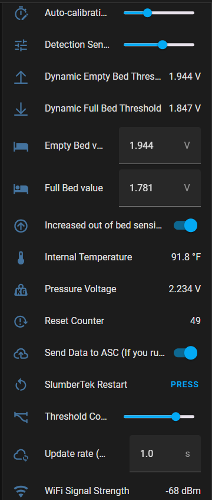

# Explanation of the User Interface (UI) entities of the SlumberTek

### To make SlumberTek smarter over time, **your device shares anonymous data with ASC**. Want to opt out or won’t be using internet? Just switch off “Send Data to ASC” below, no hard feelings 😁!

## User Interface Overview (version 0.2.3)

(SlumberTek has long UI entity names and will not be fully visible, you will need to hover your mouse over your entities to see their full names.) 

## You can watch a video about the Home Assistant Overview elements here (new 0.3.0 UI not yet added to video):
<iframe width="100%" height="315" src="https://www.youtube.com/embed/bvSiEQ0UN-s?si=crrVxkBGSvK0pGKk" title="YouTube video player" frameborder="0" allow="accelerometer; autoplay; clipboard-write; encrypted-media; gyroscope; picture-in-picture; web-share" referrerpolicy="strict-origin-when-cross-origin" allowfullscreen></iframe>

### The UI has four entities **"Calibration"**, **"Transition to Off Delay"**, **"Transition to On Delay"**, and **"Bed Sensor"**.

### Calibration (turn on, lay on bed for at least 30s, get out of bed, turn off)
This helps set the pressure thresholds for your bed the first time you use the sensor, or as a reset if you make a significant change to your bed set up. To calibration, make sure your device is placed under your mattress at chest level, toggle the calibration switch on, lay on the bed for at least 30s, get out of the bed, toggle the switch off and you're done!

### Transition to Off Delay
This is the delay before the sensor sends an "off" signal to Home Assistant. I suggest this value be at least a 2-3 seconds, as big motions during the night have a chance of triggering a false "off" signal.

### Transition to On Delay
This is the delay before the sensor sends an "on" signal to Home Assistant. Typically this value can safely be 1-2 seconds without worrying about false "on" signals.

### Bed Sensor
Binary occupancy sensor that says when someone is in bed (occupied) or not (clear).

### Calibration Status
Text entity to explain your current auto-calibration status, it will give info about whether auto-calibration is active and when your next auto-calibration is.

## Diagnostic UI entities (only visible if you go into the ESPHome device settings)

(Default Home Assistant view cuts off full names, hover your mouse over your entities to see their full names.)

# This is out date as of 5/2/25, a new 0.3.0 changed and added several new entities, page update will happen in the next week or so

### There are fourteen Diagnostic entities:

### Auto-calibration interval (0 is off)
This sets the number of hours between automatic calibration events, from 0 to 24 hours. If set to 0, auto-calibration is turned off, and the "Empty Bed value" and "Full Bed value" will remain fixed. If set above 0, auto-calibration will trigger every X hours and update the "Empty Bed value" and "Full Bed value" based on the previous 24 hours of "Pressure Voltage" data collected since the last calibration. Auto-calibration exists to help overcome slow daily and weekly changes in "Pressure Voltage" from temperature, humidity, and textile relaxation.

### Detection Sensitivity (lower is more sensitive)
Lower values help to trigger events quicker. When "Increased out of bed sensitivity mode" is *off* this value is only applied to getting into bed events ("on"). When "Increased out of bed sensitivity mode" is on, the default is increased to 6 to this applies to both the "on" and "off" events.

### Dynamic Empty Bed Threshold
If the "Pressure Voltage" signal goes *above* this value it will start the delay timer to trigger an "off" event. Decreasing the "Detection Sensitivity" make this threshold stay closer to the "Pressure Voltage" signal. 

### Dynamic Full Bed Threshold
If the "Pressure Voltage" signal goes *below* this value it will start the delay timer to trigger an "on" event. Decreasing the "Detection Sensitivity" make this threshold stay closer to the "Pressure Voltage" signal. 

### Empty Bed value
This is the upper limit for the Dynamic Empty/Full Bed threshold. You may tweak this threshold manually, and the automatic threshold will use your new value as a starting point for the next update. This value is automatically adjusted every 8 hours based on the previous 24 hours data to keep the sensor more accurate across days.

### Full Bed value
This is the lower limit for the Dynamic Empty/Full Bed threshold. You may tweak this threshold manually, and the automatic threshold will use your new value as a starting point for the next update. This value is automatically adjusted every 8 hours based on the previous 24 hours data to keep the sensor more accurate across days.

### Increased out of bed sensitivity mode
This switch helps with bed setups that struggle to recover quickly in the morning to trigger "off" events. Typically this is helpful for people with slat frames. Note: This option can *increase false off events*, increase the detection sensitivity slider to tune your bed setup if needed.

### Internal Temperature
The temperature of the CPU.

### Pressure Voltage
This is the raw signal from the SlumberTek sensor. All logic and "Bed Sensor" decisions are made from the changes of this value.

### Reset Counter
This helps keep track of how often the device is restarting if there is a firmware issue.

### Send Data to ASC (If you run no internet HA turn this off)
This setting is on by default, and is immensely helpful in identifying ways to improve firmware and software! If your Home Assistant is connected to the internet, this option anonymously sends encrypted MQTT posts to ASC's private servers. The data is labeled using your ESPHome ${name}, not your ${friendly_name}, which is defaultly slumbertek-XXXXXX (XXXXXX is the last 6 digits of your device's MAC address). ASC does not know your device's mac address and there is no way for us to identify your user data. If you have any questions about this please reach out directly to hello@asc.com. 

### Threshold Convergence Factor
This setting expands (higher numbers) or contracts (lower numbers) the "Empty Bed" and "Full Bed" thresholds. The default value is (7), increase the number to (8) or (9) if you're having trouble with timely "off" events. Alternatively, if you're having trouble with false "off" events then decrease the value to (6) or (5).

### Update rate (0 is off)
"Pressure Voltage", "Dynamic Empty Bed Threshold", and "Dynamic Full Bed Threshold" are updated to Home Assistant at a rate defined by this setting. The default is an update every 1 second and can be increased to an update every 300 seconds (5 mins). These values are only updated if they have changed since the last update.

### WiFi Signal Strength
WiFi connection strength to your device, values higher than -60dB indicate a weak WiFi signal.

Join the [ASC Discord server](https://discord.gg/cB9P6NmYJg) if you have questions or comments about this page.
