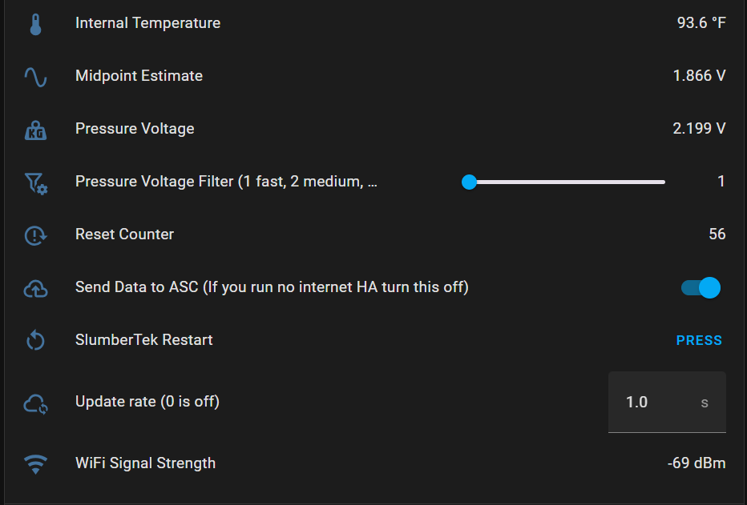

# Explanation of the User Interface (UI) entities of the SlumberTek

### To make SlumberTek smarter over time, **your device shares anonymous data with ASC**. Want to opt out or won’t be using internet? Just switch off “Send Data to ASC” below, no hard feelings 😁!

## User Interface Overview (version 0.3.0)

(SlumberTek has long UI entity names and will not be fully visible, you will need to hover your mouse over your entities to see their full names.) 

## You can watch a video about the Home Assistant Overview elements here (new 0.3.0 UI not yet added to video):
<iframe width="100%" height="315" src="https://www.youtube.com/embed/hSl5vFsuffg?si=7LCHLPQPrk4VTI1u" title="YouTube video player" frameborder="0" allow="accelerometer; autoplay; clipboard-write; encrypted-media; gyroscope; picture-in-picture; web-share" referrerpolicy="strict-origin-when-cross-origin" allowfullscreen></iframe>

### The UI has five entities **"Calibration"**, **"Transition to Off Delay"**, **"Transition to On Delay"**, **"Bed Sensor"**, **"Calibration Status"**.

### Calibration (turn on, lay on bed for at least 30s, get out of bed, turn off)
This helps set the pressure thresholds for your bed the first time you use the sensor, or as a reset if you make a significant change to your bed set up. To calibration, make sure your device is placed under your mattress at chest level, toggle the calibration switch on, lay on the bed for at least 30s, get out of the bed, toggle the switch off and you're done!

### Transition to Off Delay
This is the delay before the sensor sends an "off" signal to Home Assistant. I suggest this value be at least a 2-3 seconds, as big motions during the night have a chance of triggering a false "off" signal.

### Transition to On Delay
This is the delay before the sensor sends an "on" signal to Home Assistant. Typically this value can safely be 1-2 seconds without worrying about false "on" signals.

### Bed Sensor
Binary occupancy sensor that says when someone is in bed (occupied) or not (clear).

### Calibration Status
Text entity to explain your current auto-calibration status, it will give info about whether auto-calibration is active and when your next auto-calibration is.

## Diagnostic UI entities (only visible if you go into the ESPHome device settings)

(Default Home Assistant view cuts off full names, hover your mouse over your entities to see their full names.)

### There are twenty Diagnostic entities:

### Auto-calibration interval (0 is off)
Sets the number of hours between automatic calibration events (0–24 hours). A setting of 0 disables auto-calibration, keeping the "Empty Bed value" and "Full Bed value" fixed. If set above 0, SlumberTek will perform an auto-calibration every X hours based on the previous 24 hours of "Pressure Voltage" data. This feature compensates for slow signal drift due to temperature, humidity, and textile relaxation.

### Auto-calibration Midpoint adjuster (shifts Midpoint up and down)
Defines how far the "Midpoint Estimate" is shifted between the 24-hour maximum and minimum "Pressure Voltage". 50% sets the midpoint exactly in the center, 5% shifts it very close to the minimum, 100% shifts it to the maximum. Default is 30%, and this value directly adjusts the "Empty Bed value" and "Full Bed value".

### Auto-calibration trigger sensitivity (How much the last 24hr Pressure Voltage range must be over the current Full-Empty bed threshold gap to trigger auto-calibration)
Auto-calibration only occurs if the 24-hour range of "Pressure Voltage" exceeds this percentage of the current gap between "Empty Bed value" and "Full Bed value". This Helps prevent recalibration on inactive nights or when a pet is resting on the bed during the day.

### Dynamic Empty Bed Threshold
If "Pressure Voltage" rises *above* this value, the "Transition to Off Delay" timer begins, leading to a "clear" (out of bed) state in the "Bed Sensor".

### Dynamic Full Bed Threshold
If "Pressure Voltage" falls *below* this value, the "Transition to On Delay" timer starts, triggering an "occupied" (in bed) state in the "Bed Sensor".

### Empty Bed Detection Sensitivity (0 turns off dynamic threshold, higher is more sensitive)
Higher values pull the "Dynamic Empty Bed Threshold" closer to the current "Pressure Voltage", making it more sensitive to you getting out of bed. Too high = more false "clear" events from night motion. Default is 0. Increase if SlumberTek is slow to detect exit.

### Empty Bed threshold adjuster (percentage distance from auto-calibration Midpoint Estimate)
Adjusts "Empty Bed value" as a percentage between the auto-calibrated "Midpoint Estimate" and the 24-hour maximum "Pressure Voltage". Default is 30%. Higher values reduce false "clear" triggers from light motion.

### Empty Bed value
The *upper* limit for both dynamic thresholds. If "Pressure Voltage" is above this, SlumberTek will begin the delay timer to send a "clear" state. This value is derived from both the "Empty Bed threshold adjuster" and "Auto-calibration Midpoint adjuster".

### Full Bed Detection Sensitivity (0 turns off dynamic threshold, higher is more sensitive)
Higher values pull the "Dynamic Full Bed Threshold" closer to the current "Pressure Voltage", increasing sensitivity to you getting into bed. Default is 9 (quick response). Lower this value if false "occupied" states are triggered by pets.

### Full Bed threshold adjuster (percentage distance from auto-calibration Midpoint Estimate)
Adjusts "Full Bed value" as a percentage between the auto-calibrated "Midpoint Estimate" and the 24-hour minimum "Pressure Voltage". Default is 30%. Higher values reduce false "occupied" triggers from light pressure.

### Full Bed value
The *lower* limit for both dynamic thresholds. If "Pressure Voltage" is below this, SlumberTek will begin the delay timer to send an "occupied" state. This value is derived from both the "Full Bed threshold adjuster" and "Auto-calibration Midpoint adjuster".

### Internal Temperature
Reports the onboard CPU temperature of your SlumberTek device.

### Midpoint Estimate
Calculated during auto-calibration as the average between maximum and minimum "Pressure Voltage" values (excluding outliers) from the last 24-hours. All thresholds are centered around this estimate.

### Pressure Voltage
The raw sensor reading from SlumberTek. All calibration, thresholds, and bed presence logic are based on this value.

### Pressure Voltage Filter (1 fast, 2 medium, 3 slow)
Filters out noise and spikes in "Pressure Voltage". Higher values provide a smoother signal but reduce responsiveness. Default is 1 for fastest response.

### Reset Counter
Displays how many times the device has restarted. Useful for diagnosing firmware stability.

### Send Data to ASC (If you run no internet HA turn this off)
This setting is on by default, and is immensely helpful in identifying ways to improve firmware and software! If your Home Assistant is connected to the internet, this option anonymously sends encrypted MQTT posts to ASC's private servers. The data is labeled using your ESPHome ${name}, not your ${friendly_name}, which is defaultly slumbertek-XXXXXX (XXXXXX is the last 6 digits of your device's MAC address). ASC does not know your device's mac address and there is no way for us to identify your user data. If you have any questions about this please reach out directly to hello@asc.com. 

### SlumberTek Restart
Manually restarts your device remotely.

### Update rate (0 is off)
Controls how frequently "Pressure Voltage" and dynamic threshold values are sent to Home Assistant. Default is 1 second. Can be set up to every 300 seconds (5 minutes). Values are only sent if changed.

### WiFi Signal Strength
WiFi connection strength to your device, values higher than -60dB indicate a weak WiFi signal.

Join the [ASC Discord server](https://discord.gg/cB9P6NmYJg) if you have questions or comments about this page.
