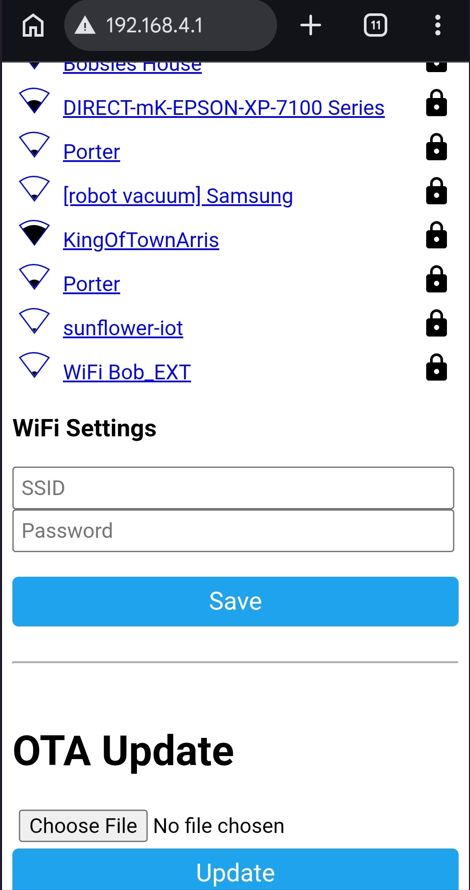

# Reconnecting SlumberTek to Wi-Fi after a Factory Reset

## A factory reset wipes everything stored on your device: your Wi-Fi credentials, your calibration, and every setting on the [SlumberTek UI & Controls](https://docs.asc.com/SlumberTek.html) page. The device is fine, it just doesn't know how to get back onto your network anymore. There are two ways to fix that and neither one takes very long.

These same two methods also work any time your device can't find your network, for example if you got a new router, renamed your network, or changed your Wi-Fi password.

## Before you start

- **2.4 GHz Wi-Fi only:** SlumberTek uses ESP32-C3 hardware and does **not** support 5 GHz networks.
- **Home Assistant users:** connect SlumberTek to the **same Wi-Fi network** your Home Assistant is on.
- **Power:** the device needs to be plugged in with its USB-C cable.
- **Method 1** only needs a phone or a laptop. **Method 2** needs a computer running Google Chrome or Microsoft Edge, plus a USB-C cable that carries **data** (charge-only cables are a very common source of grief).

### If you "took control" of your device in ESPHome
If you compiled your own YAML with your Wi-Fi credentials baked into it, your device will reconnect to your network on its own after a factory reset and you don't need this page. Those credentials live in the firmware, not in the settings that got erased. See [(Optional) Taking Control of your device in ESPHome](https://docs.asc.com/esphometakecontrol.html) if you're not sure whether this is you.

### Which method should I use?

| Method | What you need | Best when |
|:-------|:--------------|:----------|
| **1. Hotspot (wireless)** | A phone or laptop | Almost always. It's the fastest and your device can stay under the mattress. |
| **2. USB + ESP Web tools** | A computer with Chrome or Edge, a data USB-C cable | The hotspot never shows up, the sign-in page won't load, or you're already at your computer. |

## Method 1: Connect to the SlumberTek hotspot (no computer needed)

- Make sure the device is powered and wait about 30 seconds. With no saved network to join, SlumberTek starts broadcasting its own hotspot.

- On your phone or laptop, open your Wi-Fi settings and connect to **SlumberTek Fallback Hotspot**. It is an open network, there is **no password**.

<!-- Replace the image above with a screenshot of a phone Wi-Fi list showing "SlumberTek Fallback Hotspot" once you have it in images/. -->

- A sign-in page should pop up automatically after a few seconds. If it doesn't, open a browser and go to **http://192.168.4.1** while you are still connected to the hotspot.

<!-- Replace the image above with a screenshot of the captive portal network picker at 192.168.4.1 once you have it in images/. -->

- Your phone will probably warn you that this network **has no internet access** and ask if you want to stay connected. **Stay connected.** On Android it also helps to turn mobile data off for a minute, otherwise the phone quietly jumps back to cellular and the sign-in page will never load.

- Pick your 2.4 GHz network from the list, type in your Wi-Fi password, and save. If your network is hidden you can type the name in manually.

- The device will restart and join your network, and the **"SlumberTek Fallback Hotspot" will disappear from your Wi-Fi list**. That's how you know it worked! If the hotspot comes back after a minute or two, the password was rejected, so connect to it again and retype it.

- The sign-in page is a standard ESPHome feature, so if you want more detail about it you can read the [ESPHome captive portal documentation](https://esphome.io/components/captive_portal/).

## Method 2: Connect over USB with the ESP Web tools

- ESP Web tools only work with *Google Chrome* or *Microsoft Edge*. Plug your device into your computer with a data USB-C cable.

- Go to the [Easy Mode Installation](https://docs.asc.com/EasyModeInstall.html) page and click the **"SlumberTek Firmware install button"**. It's the same button you used to install, but you are **not** going to reinstall anything, we're just using it to talk to your device.

- The pop-up will ask you to select the COM port for your device. You can plug and un-plug the USB cable to see which COM port appears and disappears, pick that one and press "connect."

- Because the firmware is already on your device, you'll get a menu of device options instead of the install screen. Click **"Change Wi-Fi"** (some versions of the tool call this "Connect to Wi-Fi").

<!-- Replace the image above with a screenshot of the ESP Web Tools dialog showing the "Change Wi-Fi" option once you have it in images/. -->

### ⚠️ While you're in that menu, **do not click "Erase User Data"**. It does the same thing as the Factory Reset button and you'd be starting this page over again. Only click "Install" if you actually want to re-flash the firmware.

- Select your 2.4 GHz network, enter your Wi-Fi password, and it will let you know if it doesn't like your credentials.

- Once it says your Wi-Fi has been accepted, you're done and you can unplug the device from your computer.

### If Method 2 isn't working
- **Nothing shows up in the COM port list:** you likely have a charge-only USB cable or a missing USB driver. Hit cancel on the port dialog and the pop-up will give you some info on installing the right drivers.
- **The tool connects but won't talk to the device:** follow the [Boot Mode Instructions](https://docs.asc.com/bootmode.html) and try again.
- **The browser crashes:** this is a known ESP Web tools quirk, see [Easy Mode Troubleshooting Tips](https://docs.asc.com/EasyModeTroubleshooting.html).

## After you're back online

- **Check Home Assistant.** Your device should be rediscovered under **Settings → Devices & Services** with the same **slumbertek-XXXXXX** name it had before. If Home Assistant asks you for an IP address instead of finding it automatically, tip #2 on the [Easy Mode Troubleshooting Tips](https://docs.asc.com/EasyModeTroubleshooting.html) page walks you through finding it.

- **Re-run your Calibration!** The factory reset erased your "Empty Bed value" and "Full Bed value", so your bed sensor won't be accurate until you calibrate again. Toggle the calibration switch on, lay on the bed for at least 30s, get out of the bed, and toggle the switch off.

- **Check your other settings.** Anything you had customised is back to its default, so it's worth a look at "Send Data to ASC", "Auto-calibration interval", and your "Transition to On/Off Delay" values. They're all explained on the [SlumberTek UI & Controls](https://docs.asc.com/SlumberTek.html) page.

## Next Steps
Head back to the [UI elements of SlumberTek](https://docs.asc.com/SlumberTek.html) to get your settings dialed back in.

Please join the [ASC Discord server](https://discord.gg/cB9P6NmYJg) if you have questions or comments about this page.
