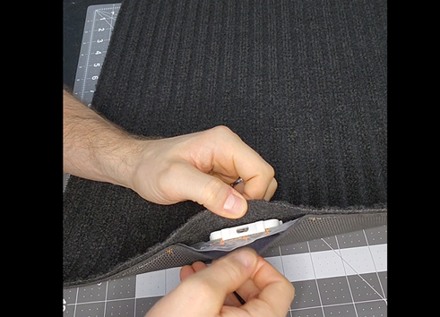
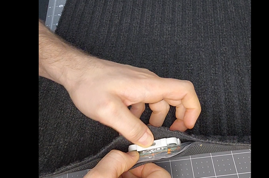
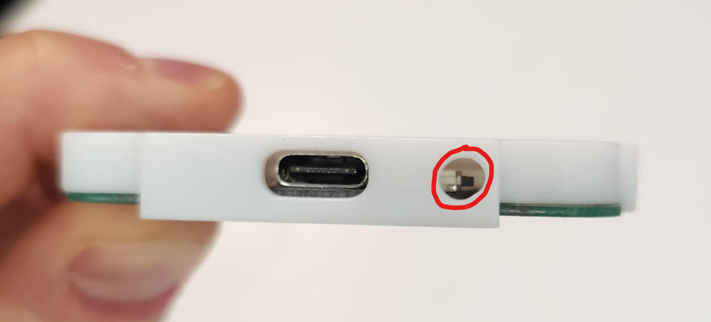
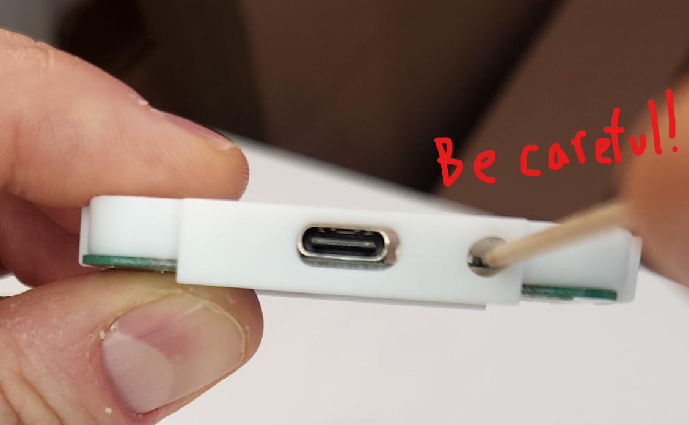
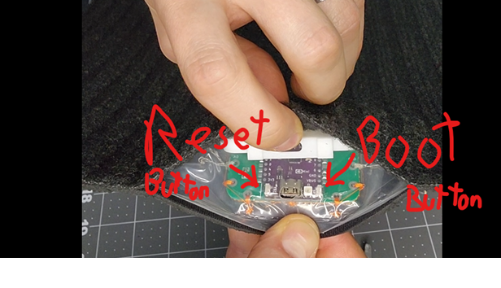
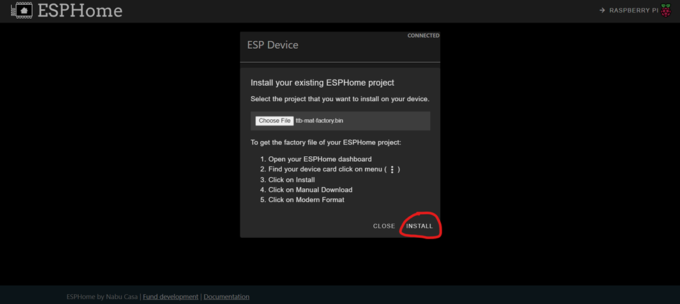
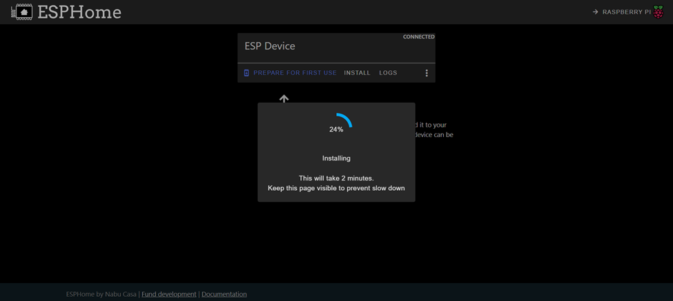
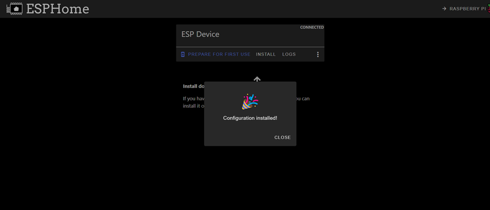
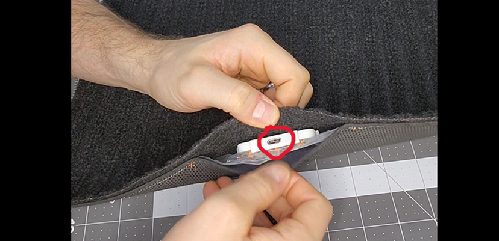

# Instructions for putting the mat into Boot Mode

## This should not be necessary for most people, but all computer setups are different and putting the mat into Boot Mode enables it to accept the new code from ESPHome.

- Disconnect the USB-C cable and pop off the protective cover of the circuit board.

  

-	There is a long plastic clip on the front and back of the protective box keeping it snapped to the circuit board. It’s tight but pry up the front of the protective box to pop it off.

 

- Alternatively, some of the new case designs have a hole that enables you to put a little screwdriver or toothpick in to push the boot button without having to take the case off. The button is a sideways button so be careful putting too much sideways pressure on it and accidentally breaking it off, you should feel a very gentle 'click' when you've pressed the button.

 
 

### If you took the protective cover off
Plug the USB-C cable back into the device. You then must hold the “Boot” button (it is a small sideways button on the right) and while the “Boot” button is held down you must press and release the “Reset” button (the small sideways button on the left).

### If you pressed the "Boot" button through the hole
You will not have access to the "Reset" button, I suggest (1) unplugging the USB cable from your computer, (2) plugging the USB-C end into the device, (3) press and hold the "Boot" button with your little screwdriver or toothpick while plugging the USB back into the computer (you may need a third hand or get creative with your grip!).

 
(Top view of the board and the "Reset" and "Boot" buttons)

-	You will need to go through the installation instruction steps and return to this screen to try the installation again.

 

-	If this step fails try doing the “Boot and reset” sequence again, as the circuit board may not have successfully entered Boot Mode. The buttons are a little hard to press, you should feel a slight 'click' when you press them down. 

-	If the install starts working, you’ll start seeing loading:

 

-	When it’s done you’ll see this!

## Put the protective cover back onto the circuit board before moving to the next steps.

 

Unplug the USB-C cable and clip the protective cover back onto the circuit board. Make sure the USB-C connection hole in the protective cover is aligned with the cutout in the waterproofing plastic sheet before squeezing the protective cover to snap it back into place. Plug the USB-C cable back in and continue to the next steps.

## Next Steps
Let's move on to setting up the YAML code on the mat [YAML Code Installation](https://appliedsensorco.github.io/Manual-Installation/yamlcode.html).

Please join the [ASC Discord server](https://discord.gg/cB9P6NmYJg) if you have questions or comments about this page.
