# (Optional) Taking Control of your deivce in ESPHome

## These instructions are optional and only if you want to view device logs and edit the YAML code directly after doing the [Easy Mode Installation](https://appliedsensorco.github.io/EasyModeInstall.html).

## If you "Take Control" of your TrampleTek Blue or SlumberTek, you'll still receive Home Assistant update notifications.
Note: If you update the firmware using Home Assistant's OTA feature after taking control, it may erase your saved Wi-Fi credentials. To reconnect, you'll need to use the device’s fallback hotspot, connect via [ESPHome Web](https://web.esphome.io/), or reinstall the firmware using the [Easy Mode instructions](https://appliedsensorco.github.io/EasyModeInstall.html).

### If you do update via OTA after "Taking Control", it's a good idea to delete the device from ESPHome.
Don’t worry, you're not deleting the actual device. It will automatically reappear under Discovered Devices (click the **Show** button in the top-right corner of the ESPHome dashboard).
Deleting and re-"Taking Control" ensures you're working with the most current code. If you don’t delete it, the YAML you see will still be from your previous “Take Control” session and may be outdated.

## These are the step-by-step instructions to "Take Control" of your TrampleTek Blue device in ESPHome.

- Open a Home Assistant tab, typically [http://homeassistant.local:8123/](http://homeassistant.local:8123/), and open ESPHome in the Settings -> Add-ons section.

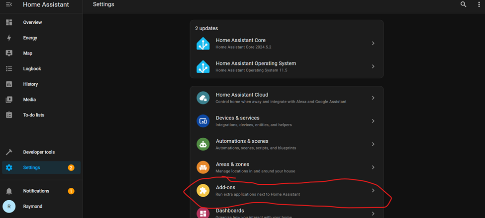

- Select ESPHome.

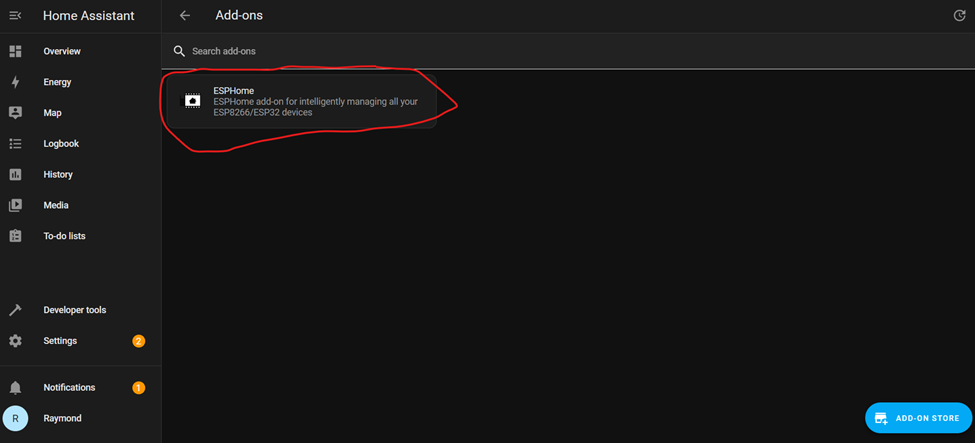

- Open the Web UI.

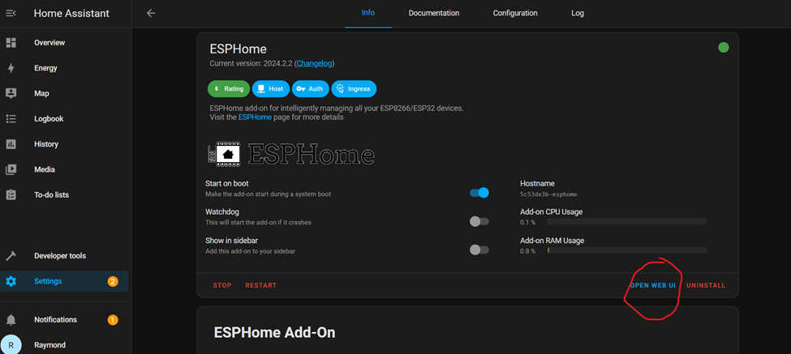

- Your device will be discovered, but hidden. Click on the "Show" in the top right corner.

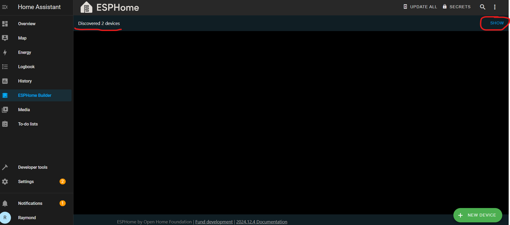 

- Click on the "Take Control" once you see the device.

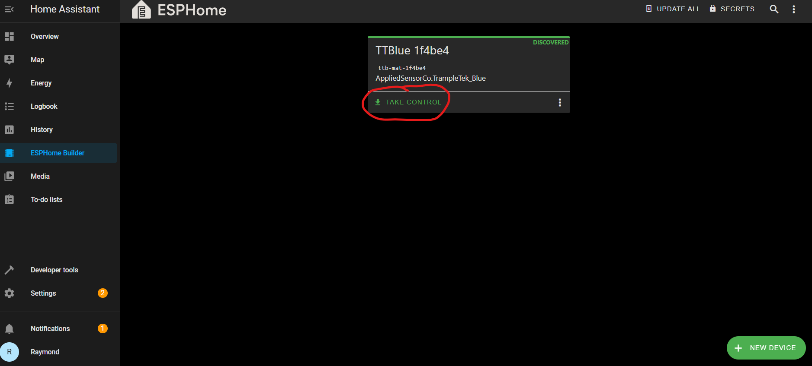 

- Give your device a useful name. I find short but descriptive is best, I picked "Raymond's Mat". Click "Take Control".

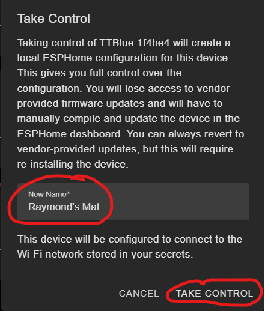 

- Click "Install" to flash the device with your new name.

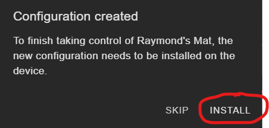 

- This part is going to take a while, like 3-5+ minutes. It's going to build the code and then install it over Wi-Fi. Make sure your device is in a good place for signal from your router. The progress bar will show installation status. Sometimes this step fails, go to the next section of this page for help.

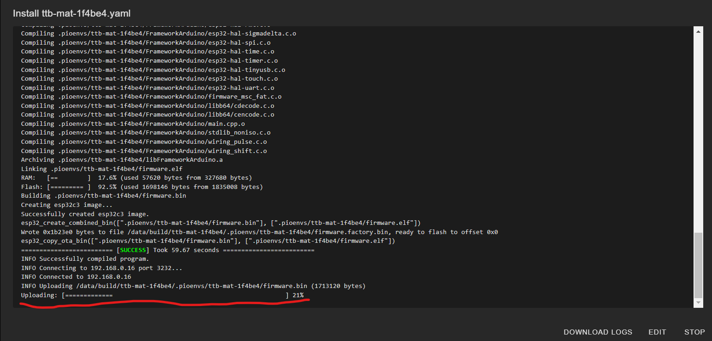
  
- Eventually you should see this, and you can close the window. Your device's UI element names should all be updated with your new name, and you can view the YAML code and device logs in the ESPHome UI.

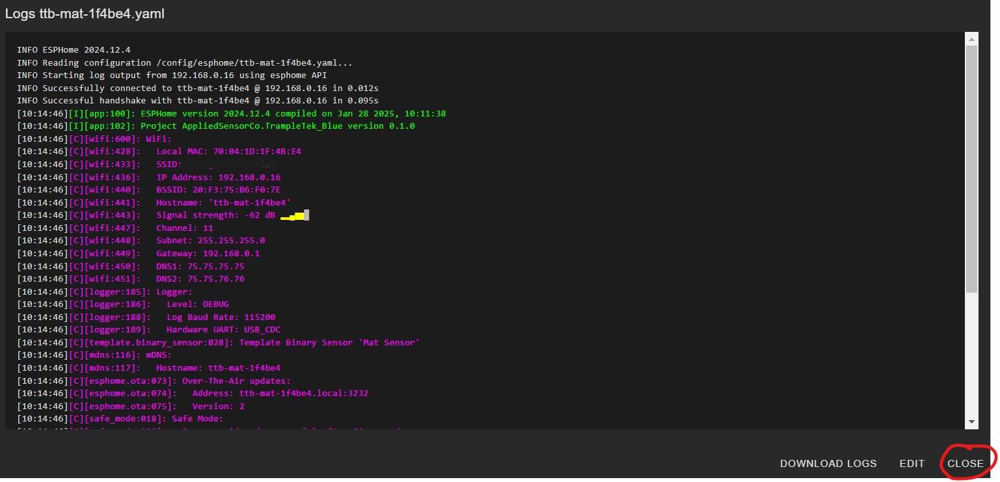 

### I have seen a Wi-Fi install error that says something like "Error resolving IP address: Error resolving address with mDNS:" when trying to "Take Control". Sometimes you just need to press "Retry" in the bottom right of LOGS screen (the screenshot above will have a "Retry" button if the upload fails). If that doesn't work, make sure your ESPHome SECRETS has your Wi-Fi information.

- Get to the ESPHome UI view and click on “Secrets” in the top right corner. 

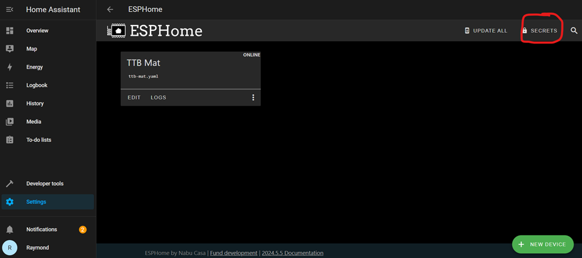 

-	If this file is empty, follow the structure of the information in the image and put in your SSID and password inside the double quotations just like the made up Wi-Fi details below. Click Save.

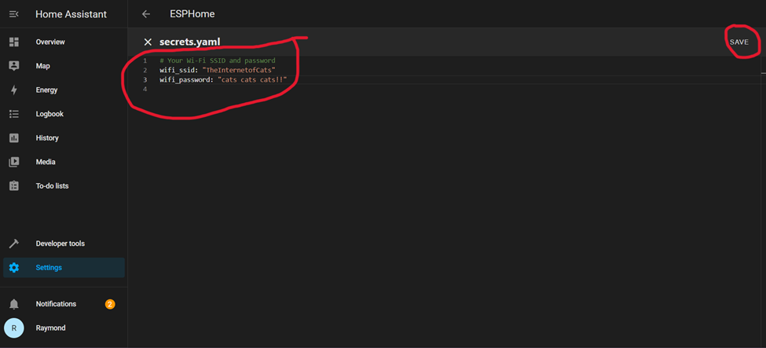

- Then go to ESPHome UI and click on "EDIT" for the device and try to install again.

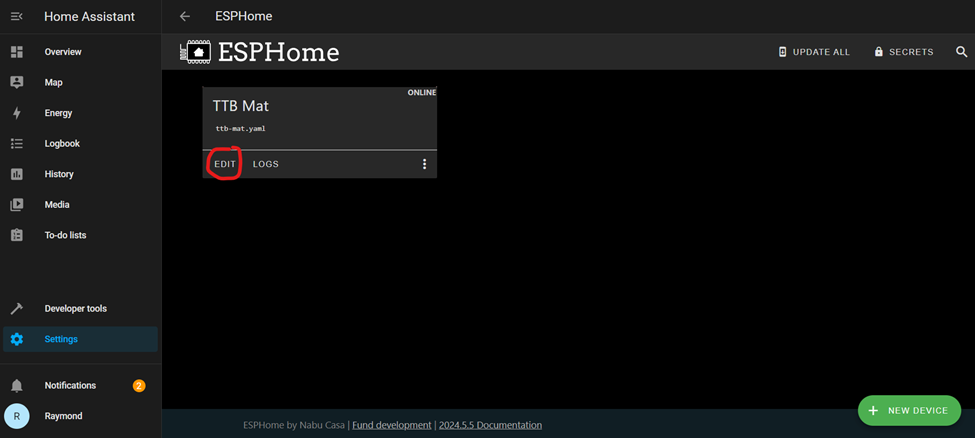 

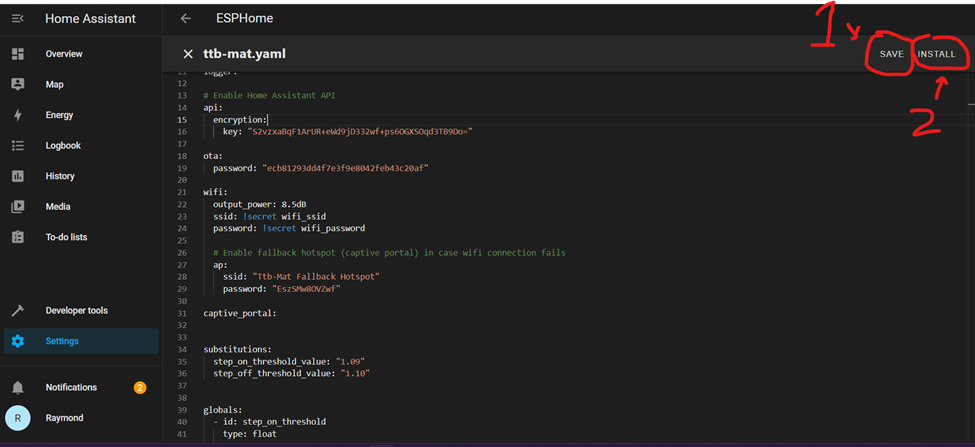 

## Next Steps
**SKIP** the Manual Installation section and move directly to [understanding the UI elements of the TrampleTek Blue (Home Assistant version)](https://appliedsensorco.github.io/usingHAui.html).

Please join the [ASC Discord server](https://discord.gg/cB9P6NmYJg) if you have questions or comments about this page.
