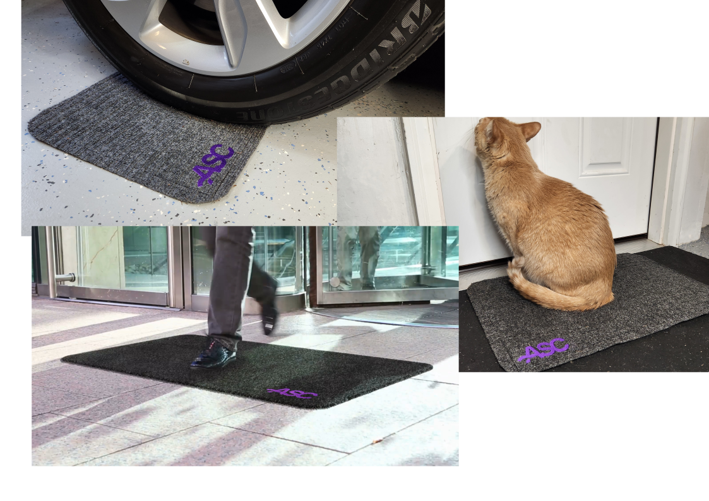

# Welcome to the documentation for Applied Sensor Co.'s products!

This documentation will help you through integrate your [TrampleTek Blue](https://asc.com/products/trampletek-blue) or [SlumberTek](https://asc.com/products/slumbertek) device into Home Assistant.

## If you're new to Home Assistant, let's get started by checking to make sure you have the [Requirements](https://appliedsensorco.github.io/requirements.html) ready.

### Please join the [ASC Discord server](https://discord.gg/cB9P6NmYJg) if you have issues, questions, or suggestions for the documentation.

You can also reach out to hello@asc.com for additional questions about ASC.

Link to the github repo for these web pages is [here](https://github.com/AppliedSensorCo/appliedsensorco.github.io).
